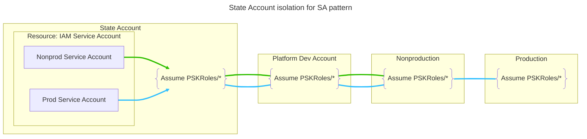
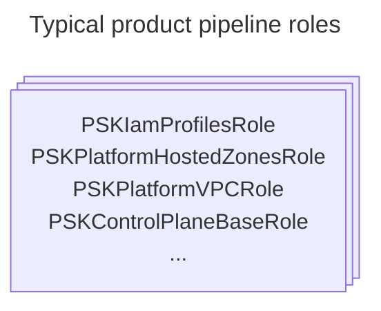
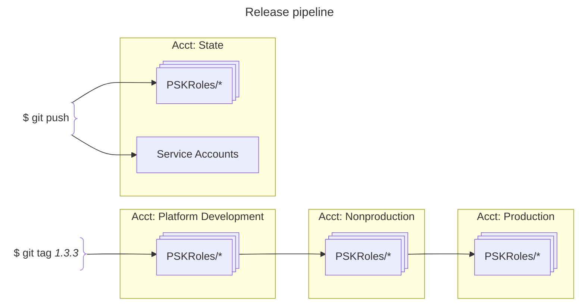

	

		
	

	<h2>psk-aws-iam-profiles</h2>
	 

This pipeline manages:  

**Product cloud infrastructure pipeline service accounts**  
Two service accounts are defined for use in the Engineering Platform product infrastructure pipelines. The service accounts do not have any permission assigned directly but are instead added to either the non-production or the production Group, respectively. The groups have policies attached that enable assumption of any role in the PSKRoles path, in the appropriate account types. The nonprod SA can assume roles in Non-production accounts. The prod SA can assume roles in both nonprod and production accounts.

The service accounts are defined in `main.tf`  

**Pipeline Roles (permissions)**  

Each Platform product infrastructure pipeline uses a specific role with the permissions required for the responsibilities of the pipeline. Pipelines orchestrate CI and CD, which can include all accounts used by the platform. Hence, the PSKRoles are an identical set of roles in each account. The SA group configuration is used to define in which accounts a particular SA can assume roles.  

As a convention, a role is named the same, or very similar, to the pipeline that uses it.  

**Release**  

### about access permissions  

In general, it is only the Engineering Platform product development team(s) that will have direct access to the cloud (AWS) accounts (as in directly assuming IAM roles). Customers of the platform will not have AWS IAM identities but rather will have access defined and maintained as part of the overall product capabilities through an external idp.  

Even though EP product team members have direct access, apart from the Development account you should not expect to see actual human write-access taking place. All change is brought about through the software-defined process and via a service account persona.  

As you can see from the above diagram, account level roles are ubiquitous. Each account used by the product has the same set of roles defined. A service account's group membership then determines which accounts the svc identity may assume any role.  

### scanning examples

This pipeline workflow includes three code scans that demonstrate two kinds of static-code inspections. TFlint performs the 'lint' style checks on terraform files for code syntax, style, and convention oriented checks. Trivy and Checkov are both used to perform security and other best-practice style scans of the code. Trivy and Checkov are not identical in their functionality, but as you might expect there is considerable overlap. Generally, teams decide on a single tool that covers the scope of things they determine of needed. Not all of the PSK exmaples will have muiltiple examples of the same type of scan using different tools but some may.  

See [maintainer notes](doc/maintainer_notes.md) for detailed information.  
